# Car Settings for Android Automotive (AAOS)

<div align="center">

[-3DDC84.svg?style=for-the-badge&logo=android)](https://source.android.com/devices/automotive)
[](https://developer.android.com/jetpack/compose)
[](#-modular-architecture)
[](preview/b-material-banner.png)
[](https://developer.android.com/training/cars/apps#rotary-controller)
[](https://github.com/binhdz1102/AOSP-Images/tree/sdk-repo-linux-system-images-automotive-mysystemapp-v4)

<p align="center">
  <b>A production-grade, modular reference implementation of the Android Automotive OS Settings application</b><br/>
  Built with 100% modern Jetpack Compose, physical Rotary Controller / Knob navigation DSL, 19 isolated feature modules, and real Vehicle HAL (VHAL) property bindings.
</p>

</div>

---

## 🎬 Preview

Below is the live execution of the Car Settings application running on an Android Automotive OS development environment, demonstrating instant responsiveness, rotary focus transitions, and smooth Compose animations:

<div align="center">
  
</div>

---

## 🏎️ Engineering & Architectural Highlights

This project serves as a showcase of senior Android & automotive software engineering practices, addressing real-world challenges in building in-vehicle infotainment (IVI) systems:

- **Jetpack Compose & Clean Architecture:** Complete reimagining of the standard AOSP XML/Preference-based Settings into a reactive, single-activity, multi-module Compose architecture.
- **Strict Intent Contract Compatibility:** Preserves public AOSP `android.settings.*` intent actions and legacy activity aliases (`WIFI_SETTINGS`, `BLUETOOTH_SETTINGS`, `APPLICATION_DETAILS_SETTINGS`, etc.), ensuring seamless drop-in system compatibility.
- **Rotary Focus Controller & Direct Manipulation:** First-class physical rotary knob navigation, custom focus rings, Direct Manipulation mode for sliders/dials, and Focus Parking View integration to comply with automotive driver safety standards.
- **19 Feature Modules:** High separation of concerns with domain, data, presentation, and feature tests isolated across 19 feature packages, governed by custom Gradle convention plugins (`build-logic`).
- **Vehicle HAL (VHAL) & CarPropertyManager Adapters:** Robust vehicle-property layer handling multi-zone temperature, seat kinematics, lighting, and ADAS telemetry with explicit state handling (`Available`, `Unavailable`, `Error`, `ReadOnly`).
- **Automotive Ergonomics:** Strict adherence to Driver Distraction Guidelines (DDG), high-contrast night/day visibility, 48+ dp interactive touch targets, and automotive scrollbar gutters.

---

## 🎨 UI Architecture: Powered by B-Material

<div align="center">

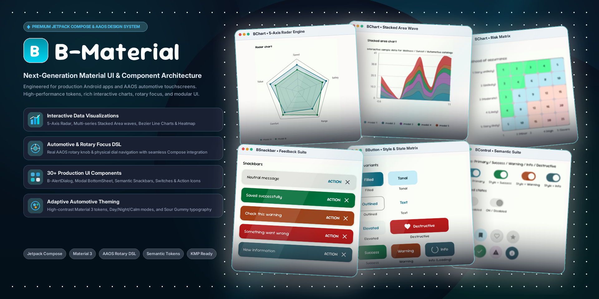

</div>

### Key capabilities provided by B-Material:
- **Automotive Rotary Focus DSL:** Declarative rotary focus modifiers, active outline states, and rotary-scroll synchronizers.
- **Semantic Tokens & Theming:** High-contrast Material color palettes optimized for cabin ambient lighting conditions (Day / Night / Calm modes) and typography (`Sour Gummy` display headings paired with `Inter` body text).
- **UI Components:** Pre-built components with rendering performance optimized for various screen types.
- **Data Visualizations & Specialized Controls:** Interactive multi-zone cabin overlays, Bezier curve charts, ergonomic sliders, and modal bottom sheets.

---

## 📸 Key Feature Showcase

### 1. Vehicle Cabin & Climate Controls

| Multi-Zone HVAC & Temperature | Seat & Steering Wheel Adjustment |
| :---: | :---: |
| 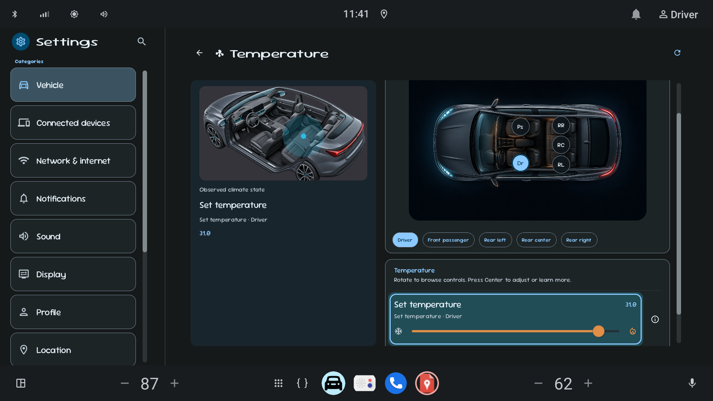 | 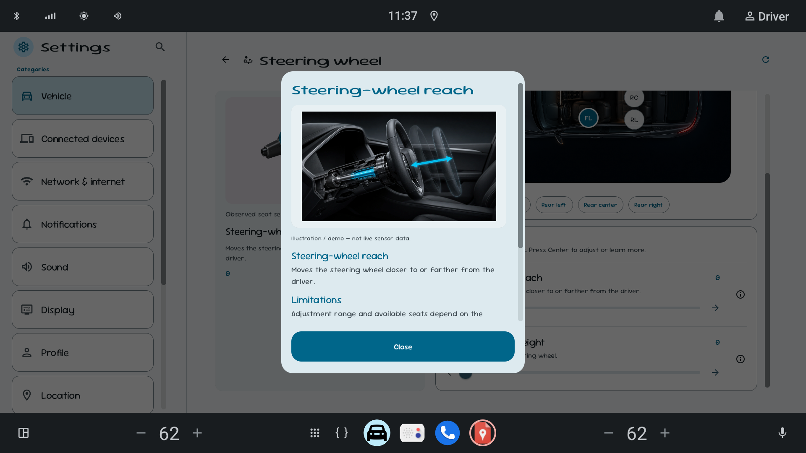 |
| *Interactive 5-zone cabin top-view (Dr, Ps, RL, RC, RR) based VHAL climate properties.* | *Kinematic reach and height configuration with zone awareness and visual limits.* |

| Intelligent Interior Lighting | Vehicle Settings Hub |
| :---: | :---: |
| 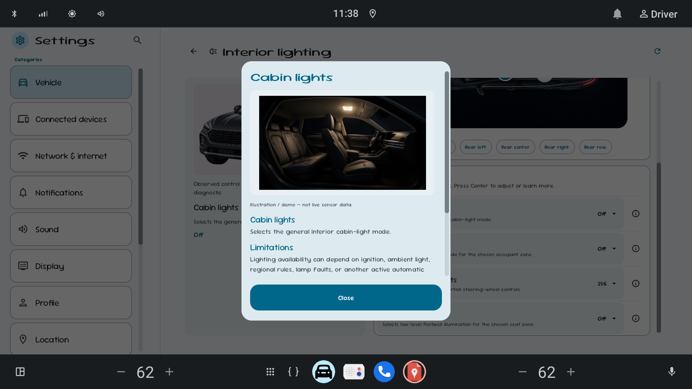 | 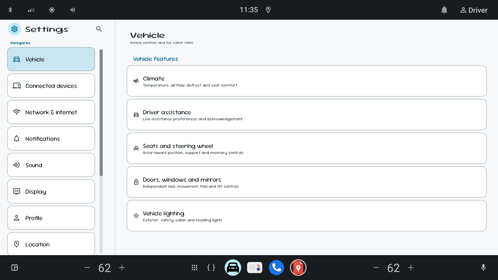 |
| *Cabin ambient lights, reading lights, and footwell illumination mode selector.* | *Top-level vehicle feature hub categorizing climate, ADAS, seats, doors, and lights.* |

---

### 2. Driver Assistance & Safety Systems (ADAS)

| Blind Spot Warning & Collision Avoidance | Lane Support & Centering Assist |
| :---: | :---: |
| 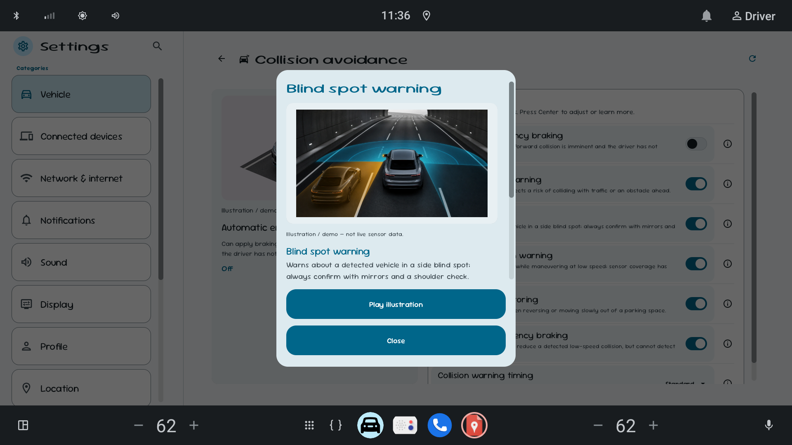 | 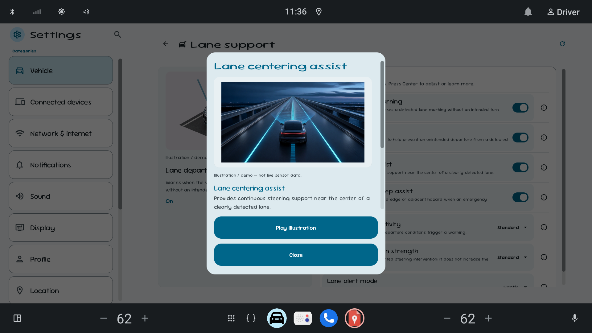 |
| *Contextual safety warning dialog with animated graphic illustration and quick action buttons.* | *Emergency lane departure assist, sensitivity thresholds, and haptic feedback toggles.* |

---

### 3. Connectivity, Display & System Management

| Network & Wi-Fi Configuration | Display Brightness & Dark Theme |
| :---: | :---: |
| 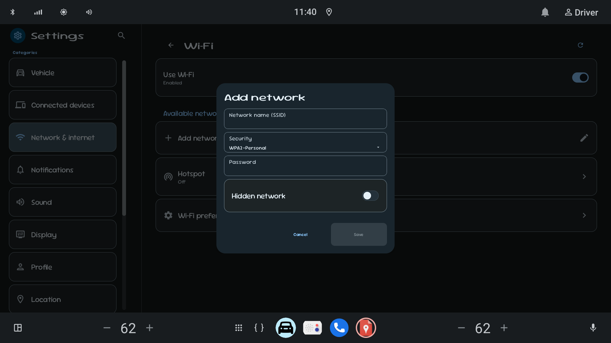 | 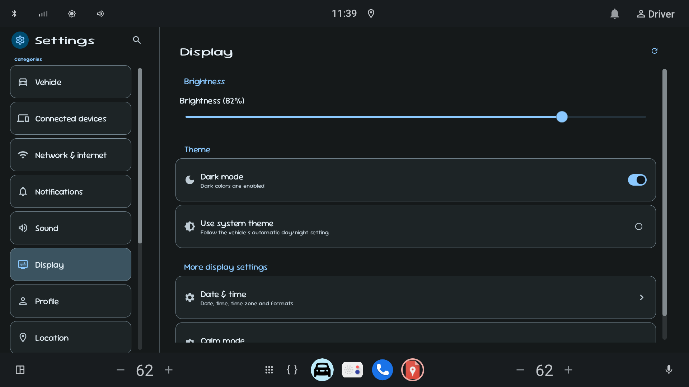 |
| *Wi-Fi modal dialog with security protocol dropdown and keyboard entry.* | *82% brightness slider, system automatic day/night theme sync, and Calm Mode.* |

| Default Applications & Rotary Highlight | In-App Real-Time Search |
| :---: | :---: |
| 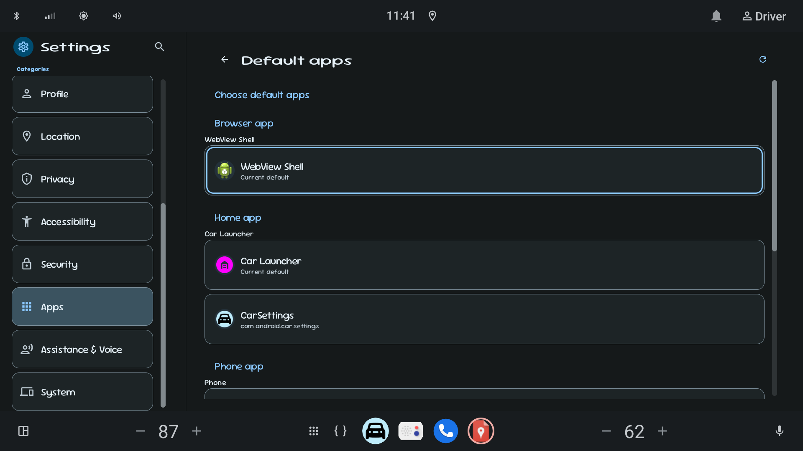 | 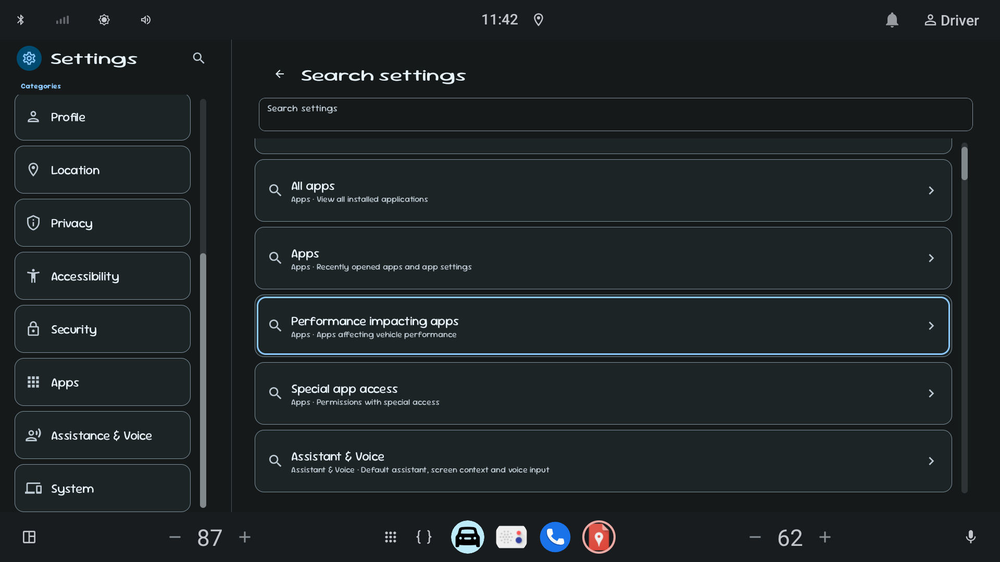 |
| *High-visibility cyan rotary focus indicator highlighting active items for rotary controller selection.* | *Universal search indexing settings across all 19 feature domains with immediate query matching.* |

---

## 🏛️ Modular Architecture

The codebase follows a modular clean architecture designed for large engineering teams, enforcing clear dependency rules and fast incremental build times:

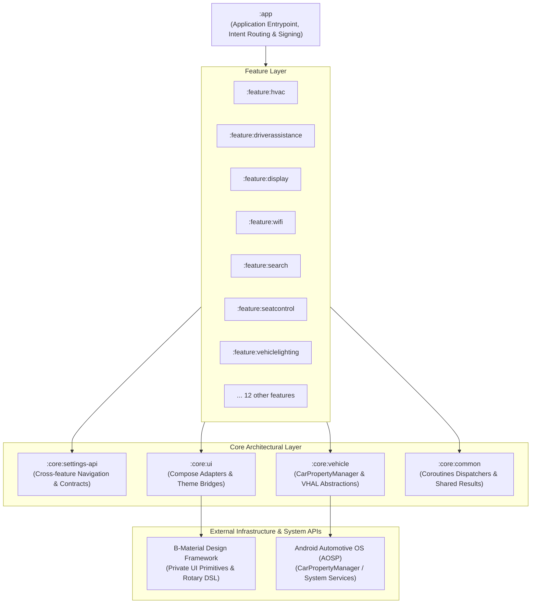

---

## 🛠️ Tech Stack & Engineering Practices

- **Language & Runtime:** Kotlin 2.x, Coroutines & StateFlow for reactive unidirectional state management.
- **UI Toolkit:** Jetpack Compose for Android Automotive, Material 3, and B-Material Design System.
- **Dependency Injection:** Dagger Hilt with scoped ViewModels and feature-isolated bindings.
- **Navigation:** Jetpack Navigation Compose with type-safe arguments and AOSP Intent action interop.
- **Hardware Integration:** Android Car API (`android.car.*`), `CarPropertyManager`, and VHAL mock telemetry generators.
- **Build System:** Gradle Kotlin DSL, Version Catalogs (`libs.versions.toml`), and composite convention plugins (`build-logic`).
- **Code Quality:** Unit tests with MockK, Kotlinx Coroutines Test, Compose UI tests, and Android Lint.

---

## 🚀 Quick Start & Running

### ⚡ Pre-Configured AAOS System Image (Ready to Run)

This project can be tested and run directly on a pre-built, fully configured Android Automotive OS virtual device without needing to build AOSP or configure platform signature keys from scratch:

> 📦 **Download Pre-Built AAOS Image:**  
> [binhdz1102/AOSP-Images (Branch: `sdk-repo-linux-system-images-automotive-mysystemapp-v4`)](https://github.com/binhdz1102/AOSP-Images/tree/sdk-repo-linux-system-images-automotive-mysystemapp-v4)

**Pre-configured environment highlights:**
- **System App Privileges:** Pre-granted platform permissions required for system settings and cross-user interactions.
- **Matching Platform Keys:** Pre-aligned with the project's development platform certificate (`keystore/platform.p12`).
- **Vehicle HAL (VHAL) Support:** Pre-configured car property services for HVAC, seats, and ADAS controls.

### Prerequisites
- JDK 17
- Android SDK 36 (Android 16 / Baklava) and Platform Tools
- AAOS Android Virtual Device (using the pre-configured system image above) or compatible hardware head unit

### 1. Build and Run Unit Tests
```bash
./gradlew testDebugUnitTest
```

### 2. Assemble Debug APK
```bash
./gradlew :app:assembleDebug
```

### 3. Install to Connected Automotive Emulator/Device
```bash
adb install -r -d -g app/build/outputs/apk/debug/app-debug.apk
adb shell am force-stop com.android.car.settings
adb shell am start -a android.settings.SETTINGS
```

### 4. Direct Intent Navigation Testing
Verify system intent aliases and deep-links directly via ADB:
```bash
# Launch Wi-Fi Settings directly
adb shell am start -a android.settings.WIFI_SETTINGS

# Launch Bluetooth Settings directly
adb shell am start -a android.settings.BLUETOOTH_SETTINGS

# Launch App Info directly
adb shell am start -a android.settings.APPLICATION_DETAILS_SETTINGS -d package:com.android.car.settings
```

---
